# NWIS-X Architecture & Technical Specification

> **Nearby Wells Intelligence & Risk eXplorer**  
> Problem Statement: **SIH26121 — Oil India Ltd**  
> *Depth-Aware Drilling Institutional-Memory & Early-Warning Platform*  
> ⚠️ **SIMULATED DATASET ONLY — ZERO OIL INDIA PROPRIETARY ASSETS USED**

---

## 1. High-Level Architecture Overview

```mermaid
graph TB
    subgraph Client ["Client Presentation Tier (React 18 + Vite + TailwindCSS)"]
        UI_Dash["Operations Dashboard"]
        UI_Map["Spatial PostGIS Map (Leaflet)"]
        UI_Depth["Depth-Aware Stratigraphic Slider"]
        UI_Radar["Deterministic Risk Radar"]
        UI_Copilot["Institutional Memory Copilot"]
        UI_Compare["Side-by-Side Well Comparison"]
        UI_Audit["Admin Compliance Review"]
    end

    subgraph API ["Application & API Tier (Python 3.11 / FastAPI / Async)"]
        Router_Auth["/api/v1/auth (JWT + bcrypt)"]
        Router_Wells["/api/v1/wells (CRUD + Nearby Spatial)"]
        Router_Risk["/api/v1/risk (Deterministic Engine + Alerts)"]
        Router_Sim["/api/v1/similarity (Multi-factor Matching)"]
        Router_Copilot["/api/v1/copilot (RAG + Mandatory Citations)"]
        Router_Reports["/api/v1/reports (ReportLab PDF Generation)"]
    end

    subgraph Engines ["Deterministic & Processing Services Tier"]
        Service_Sim["Similarity Engine<br/>(Spatial + Depth + Formation + Incident + Semantic)"]
        Service_Risk["Risk Engine<br/>(Pressure + Historical + Geological + Mechanical)"]
        Service_RAG["RAG Copilot Service<br/>(Strict Narration + Document/Page Citations)"]
        Service_NLP["NLP Extraction Service<br/>(Regex + Entity Rule Matcher)"]
        Service_OCR["OCR Pipeline<br/>(PaddleOCR / PyTesseract / PyPDF)"]
        Service_PDF["ReportLab PDF Generator<br/>(Audit Dossier with Simulated Watermarks)"]
    end

    subgraph Data ["Persistence Tier (PostgreSQL 15 Single-Engine Database)"]
        DB_PostGIS["PostGIS Spatial (SRID 4326 / Geodesic)"]
        DB_Vector["pgvector (384-dim all-MiniLM-L6-v2 Embeddings)"]
        DB_Relational["Relational Tables<br/>(Wells, Formations, Events, Documents, Alerts, Users)"]
    end

    Client -->|REST API / HTTPS| API
    API --> Engines
    Engines --> Data
```



---

## 2. Non-Negotiable Architectural Principles

| # | Principle | Architectural Realization |
|---|---|---|
| 1 | **No Proprietary Data** | Synthetic dataset generated exclusively from public Assam-Arakan Basin geological literature (Digboi, Nahorkatiya, Moran, Baghjan). Prominent `SIMULATED DATA` banner on all screens, endpoints, and PDF reports. |
| 2 | **LLM Never Generates Facts** | All risk indices and similarity metrics are computed deterministically via mathematical models and empirical rules. LLM is strictly confined to narrating verified facts with citations. |
| 3 | **Single Unified Database** | Single PostgreSQL 15 instance unifying PostGIS (spatial proximity), pgvector (semantic document retrieval), and relational integrity. No Neo4j or external graph dependencies. |
| 4 | **Universal Evidence Trail** | Every alert and query response exposes: **WHY**, **WHICH WELLS**, **DEPTH**, **FORMATION**, **EVIDENCE**, **SOURCE DOC+PAGE**, **SIMILARITY**, **CONFIDENCE**. |
| 5 | **Single-Command Startup** | Docker Compose orchestration (`docker-compose up -d`) spins up DB with PostGIS+pgvector, backend API, and frontend server in one step. |

---

## 3. Mathematical Foundations of Deterministic Engines

### 3.1 Multi-Factor Well Similarity Formulation
Similarity between query well $W_q$ and candidate offset well $W_c$ is computed deterministically across 5 independent dimensions:

$$\text{Similarity}(W_q, W_c) = w_s S_{\text{spatial}} + w_d S_{\text{depth}} + w_f S_{\text{formation}} + w_e S_{\text{event}} + w_m S_{\text{semantic}}$$

Where weights are calibrated for drilling offset analysis:
- $w_s = 0.35$ (Spatial Proximity via Haversine Geodesic Decay: $S_{\text{spatial}} = e^{-D_{\text{km}}/15.0}$)
- $w_f = 0.25$ (Stratigraphic Lithology Match via Jaccard Index: $S_{\text{formation}} = \frac{|F_q \cap F_c|}{|F_q \cup F_c|}$)
- $w_d = 0.15$ (Total Depth Divergence: $S_{\text{depth}} = \max(0, 1 - 2\frac{|\text{TD}_q - \text{TD}_c|}{\max(\text{TD}_q, \text{TD}_c)})$)
- $w_e = 0.15$ (Incident Pattern Overlap across Kicks, Losses, Sticking: $S_{\text{event}} = \frac{|E_q \cap E_c|}{|E_q \cup E_c|}$)
- $w_m = 0.10$ (Semantic / Field Structural Alignment)

### 3.2 Deterministic Risk Assessment Formula
Risk is evaluated across four empirical engineering vectors:

$$\text{Risk}_{\text{overall}} = 0.30 R_{\text{pressure}} + 0.25 R_{\text{historical}} + 0.25 R_{\text{geological}} + 0.20 R_{\text{mechanical}}$$

- **Pressure Risk ($R_{\text{pressure}}$)**: Triggered by offset kicks ($SIDPP > 300\text{ psi}$), lost circulation, and overpressured Barail/Kopili sequences.
- **Geological Risk ($R_{\text{geological}}$)**: Triggered by reactive smectite clay swelling (Girujan Clay), fault plane proximity, and borehole shear failure.
- **Mechanical Risk ($R_{\text{mechanical}}$)**: Driven by differential sticking probability in permeable Tipam sandstones under overbalance conditions ($>1000\text{ psi}$) and extended reach drag.
- **Historical Risk ($R_{\text{historical}}$)**: Frequency-weighted incidence rate of critical and high-severity events in nearby offset records within the same depth window ($\pm150\text{m}$).

---

## 4. Phase 3: Advanced Architecture Specifications (Design Only)

### 4.1 Real-Time WebSocket Early Warning Delivery System
```
┌─────────────────┐      WITSML 1.4      ┌──────────────────┐
│ Rig MWD/LWD Rig │ ───────────────────> │ Ingestion Worker │
└─────────────────┘                      └────────┬─────────┘
                                                  │
                                         ┌────────▼─────────┐
                                         │ Rule & Risk Bus  │
                                         └────────┬─────────┘
                                                  │ Pub/Sub
                                         ┌────────▼─────────┐
                                         │ WebSocket Hub    │
                                         └────────┬─────────┘
                                                  │ WSS Broadcast
                                         ┌────────▼─────────┐
                                         │ Web Client Alert │
                                         └──────────────────┘
```
- **Protocol**: Secure WebSocket (`wss://`) connected to FastAPI `/ws/alerts/{rig_id}`.
- **Event Filtering**: Clients subscribe to radius-based spatial channels (e.g. `geo:assam:moran`) and depth windows.
- **Backpressure & Heartbeat**: Ping/pong heartbeat every 15 seconds with Redis Pub/Sub multiplexing for multi-rig scaling.

### 4.2 ML-Based Anomaly Detection Pipeline (Next-Gen Expansion)
- **Model Topology**: Semi-supervised Temporal Convolutional Autoencoder (TCN-AE) + Isolation Forest trained on normal mud circulating parameters.
- **Input Channels**:
  1. Standpipe Pressure (SPP) variance
  2. Delta Flow Out vs. Flow In (Pit Volume Gain rate)
  3. Rate of Penetration (ROP) normalized for Weight on Bit (WOB) and RPM (Drilling Exponent $d_{xc}$)
- **Inference Latency Target**: $<500\text{ ms}$ on 1-Hz rig sensor stream.
- **Rule of Precedence**: ML anomaly triggers a secondary advisory flag but CANNOT overwrite deterministic safety limits.

### 4.3 Multi-Tenant Enterprise Asset Access Control
- **RBAC Matrix**:
  - `Field Engineer`: Read access to assigned asset wells and copilot queries; can submit daily drilling observations.
  - `Operations Geologist`: Full access to stratigraphic picks, offset comparisons, and formation updates.
  - `Drilling Superintendent (Admin)`: Authority to approve/reject Copilot narrations and override risk thresholds.
- **Row-Level Security (RLS)**: PostgreSQL native RLS policies isolating concessions by oilfield block code.

### 4.4 WITSML / LAS Stream Integration Architecture
- **Standard Support**: Energistics WITSML 1.4.1.1 and 2.0 XML schemas for real-time well trajectory and mud log objects.
- **LAS Parser**: Streaming LAS 2.0 / 3.0 parser for wireline logs (Gamma Ray, Resistivity, Sonic, Density-Neutron) converting depth-indexed curves to PostGIS 3D Wellbore trajectories (`ST_MakePoint(x, y, z)`).

### 4.5 Offline-First Progressive Web App (PWA)
- **Service Worker Cache**: Cache First strategy for base map vector tiles of Upper Assam and static well databases.
- **Local Storage**: IndexedDB cache of nearest 10 offset well completion reports for disconnected operational access at remote drill sites.
